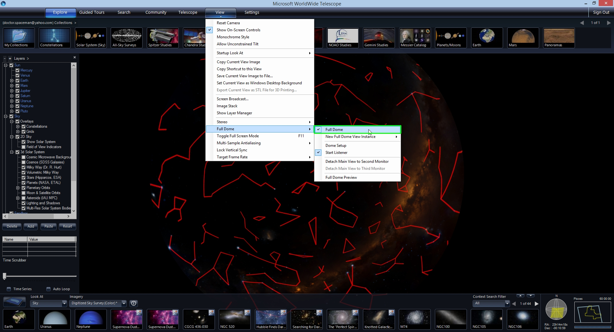
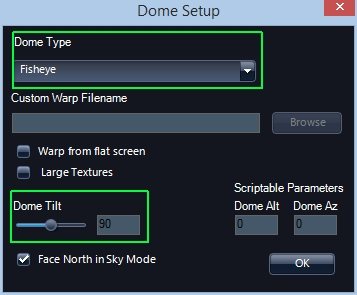
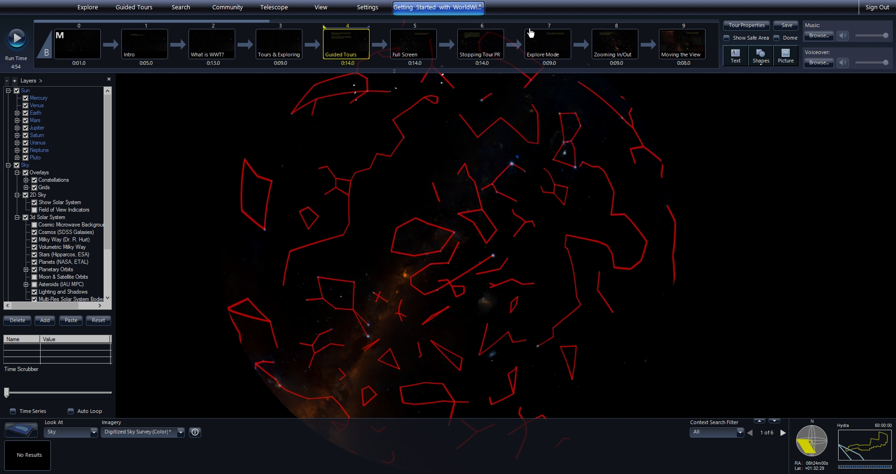
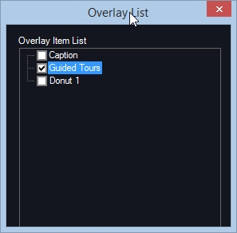
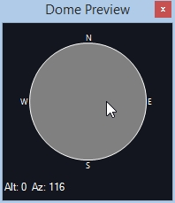

+++
title = "Authoring for the Dome"
weight = 200
+++

AAS WorldWide Telescope has specific functionality to enable dome authoring
and playback. Technically, tours created on/for a flat display, such as a
laptop, will work on the dome. However, differences in the projection and the
field of view create challenges to creating content on a flat screen and
having it look good in a dome. This guide will go over some function in WWT
that help move between these two views.

The main window view can be changed to preview a full dome view. To go into a
dome view, under the View tab, select "Full Dome/Full Dome."

**Note:** The default full dome view has a wide hemispherical view of 180
degrees. In the flat projection the default view is about 60×34 degrees.
Where this sub-region of the full dome view is located on the dome is
controlled by the dome tilt. At 90 degree dome tilt, this view will be at
the Zenith and at 0 degree dome tilt it will be near the bottom of the full
dome image in the front.

# Authoring on Single-Projector Systems

For systems with a single fish-eye or mirror-dome projector attached to a
separate video output on the Master Server — which is probably the only
computer, under the View tab, you can select “Full Dome/Detach Main View to
Second [or Third] Monitor.” This will allow full-dome authoring playback on
the same system. Menu and interface windows stay on the first monitor and the
second or third monitor outputs drives the single full-dome projector. In this
case, text positions are placed in the dome view and seen in the same way it
will be viewed in a show, which facilitates the placement of their placement,
as well as the pacing of motion, etc.

To setup the dome parameters, select **View/Full Dome/Dome Setup**, which
opens a setup window.

Under Dome Type, you can select “FishEye,” “Mirrordome 16:9” or “Mirrordome
4:3.” You can also set the Dome Tilt. Multiple projector, or non-standard
projections can be implemented by solving for projector geometries using
“Settings/Advanced/Multi-Channel Calibration.” **TODO cross-ref the
planetarium guide**

If you have a single Projector Server which is different from the Master, the
dome setup is the same but you will need to setup a simple 2-computer cluster.
**TODO cross-ref the planetarium guide**

# Authoring on Flat Displays for Presentation on Dome

The remainder of this document will that assume you are authoring on a flat
screen and will be playing back on another full-dome system, which could
potentially be multi-channel. WWT has specific tools to facilitate this.

In the full-dome view the size and location of overlay objects like text,
shapes and images makes it hard to see them when the hemisphere is projected
back onto a flat screen as a full dome preview. Usually in the flat screen you
just click on overlay objects in the main view. However, it is sometimes hard
to see the overlaid objects in full dome preview on a flat screen. Note, that
even if you can see the objects it is hard to actually select one to move,
edit, etc.

## Full Dome Mode

On a desktop you can view the full dome view in the main window by selecting
{{ui(p="View > Full Dome > Full Dome")}}. This will change the main view into
a hemisphere projected onto a flat display with black area around it.

### Overlay List

To interact with overlay objects (Text, Shapes & Pictures) in dome mode it is
easier to use the Overlay List window, which is accessed under {{ui(p="Guided
Tours/Show Overlay List")}}. The overlay objects have names that default to
file names for imported pictures or the first line of text for text object.
Shapes are named by their name followed by a number (e.g., “Donut 1”). You can
always rename any overlay object by right-clicking and opening the Properties
dialog.

Right-clicking on any of the images brings up a menu. Most options are the
same is if you right clicked on the object in the main view. You also have an
“Edit” option which is the same as double-clicking the overlay object in the
main view. The Overlay List can make objects accessible when they are hard to
click on in dome mode or off-screen or hidden under menu tabs.

### Dome Preview

You can view a flat projection of a part of the full dome view using the Dome
Preview. Since this is a flat projection you must make sure you are _not in
full dome mode_. Make sure that {{ui(p="View > Full Dome > Full Dome")}} is
unchecked. At this point you are viewing a virtual camera view of the full
dome view. You can move the camera to see in detail what is being shown on any
part of the dome with the Dome Preview window, which is shown by selecting
{{ui(p="View > Full Dome > Full Dome Preview")}}.

As you click your mouse and move it in the grey circle in the Dome Preview the
main window will show a smaller tangent view of the full dome view. The
preview is centered on the Alt/Az positions shown in the lower left hand
corner of the Dome Preview window which changes are you click and move your
mouse.
