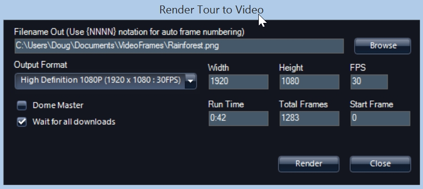
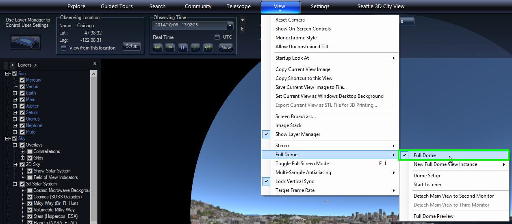

+++
title = "Rendering To Video"
weight = 600
+++

You can use WWT to create still frames that can be encoded into a video. Note
that WWT writes out a sequence of frames and does not do the encoding to
video. You will have to use another solution to create the video and include
any audio. Some suggestions are given below. Rendering out of WWT might be
desired in the following situations:

* You have a planetarium with its own video playback system.
* You want to combine WWT images and videos with other content. For instance,
  this could be done to use WWT to render out a star field at a certain time
  and then composite a horizon or other elements in front of it. Or you might
  want to render some scenes in WWT and other ones in another package and then
  splice them together.
* You want to distribute a video to YouTube or create a video for a
  presentation in PowerPoint.

# Simple Case

In the case of a flat screen, things are pretty straightforward. Once a tour
your want to render out is loaded, select {{{ui(p="Guided Tours > Render to
Video")}}. This will open the Render Tour to Video dialog box.

By default the frames are written to the `VideoFrames` folder under your
`Documents`. In the dialog box, you just need to specify a filename. WWT will
create a sequence of frames based on that name. If you give the name
`C:\Users\Doug\Documents\VideoFrames\Rainforest.png` in the dialog box, WWT
will write a sequence of images named `Rainforest_0000.png`,
`Rainforest_0001.png`, etc. You should also leave the output extension as PNG.
Don’t change it to anything else or give the name without an extension. WWT
only writes PNG files.

Also, currently for flat (i.e., non-dome) output format is set to the same
resolution as the display, so if you are on a 1080×1920 display that will be
the output size of the PNG images. For flat screens, don’t change these
numbers and WWT only renders out 30 frames per second (FPS).

The **Run Time** and **Total Frames** are reported from the Tour. You can
adjust the **Start Frame** number to begin rendering frames to some point into
the Tour. This can be useful when you want to render frames in sections or
make a change to a part of the tour and render those frames out. Note, there
is no way to specify the end frame here, so you will have to watch the
progress dialog that reports how much has been rendered and then click
**Cancel** when you want to stop it.

When rendering, we recommend checking the box **Wait for all downloads**,
which will force WWT to wait to load any data, tiled images, 3D terrain, 3D
cities needed to render each frame. Unless you just want to make a quick small
pre-visualization, the additional amount of time to wait for all data to
download is a small price to pay for better rendered output.

# Targeting the Dome

To render frames for dome output you have to do the following:

1. Make sure you are in Dome view. Select this under **View/Full Dome/Full Dome.**
2. Open the **Render Tour to Video** dialog box.
3. Check the **Dome Master** check box.
4. Check the **Wait for all downloads** check box.
5. In the **Output Format** pull-down, select one of the Dome Master formats:
   1k, 2k, 3k, 4k, or 8k.
6. Click Render to write the files.

Note that for large 4k or 8k images, writing each frame may take several
seconds.

# Making Video from Rendered Frames

Once you have your frames rendered you can make the output into a video. This
functionality is not built into WWT, but here are some options
of how to proceed.

First make sure the frames look OK and that the frame numbers are contiguous.
Be careful if you render parts and try to put them together. If you do that we
recommend that you render each part to its own folder and then copy the frames
you want into a final folder.

If you want to add audio, you can use the voiceover and music audio files from
the tour. Note, that you can include a sequence of audio files associated with
each slide, but it may be easier if you combine those files outside the video
encoding program and bring in just one audio file for voiceover and one for
music.

QuickTime Pro is a relatively inexpensive way to encode the sequence of PNG
files into a video.

1. Open the PNG images by selecting **File/Open Image Sequence…** Browse to
   the name of the _first file_ of the sequence. This will open the sequence
   in its own window.
2. In that new window, select **File/Export**, which will bring up a dialog
   box.
3. Set the output video file name and options in this box and then click
   **Save**.

Adobe Premiere is a more powerful way to encode video.

1. Open the PNG images by selecting File/Import and then browsing to the name
   of the first file of the sequence. Check the **Image Sequence** box above
   the file name and click {{ui(p="Open")}}.
2. In a similar way you can import your audio tracks as well.
3. You will see your image sequence and audio if you imported that in the
   media browser in the lower left panel. Drag the image sequence and audio
   files into the timeline in the lower right.
4. To output the video, select {{ui(p="File > Export > Media …")}}. You can
   change any of the export controls in the dialog box and when you are happy
   click the **Export** button.
