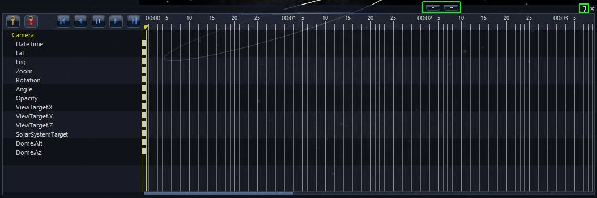
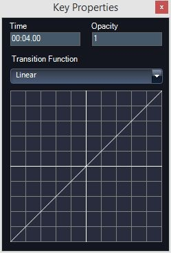

+++
title = "Using the Timeline Editor"
weight = 400
+++

Slide-based tours have only a start and end position and WWT smoothly moves
between them. However, you may need finer control to change views, location
and appearance of objects in a more flexible fashion. To do this, you can edit
the timeline control for each slide of a tour.

**Important**: Tours built using timelines can only be played back on WWT 5.0
  or later.

# Tutorial Video

{{ youtube(id="lXIJgfedCHE", class="youtube-embed") }}

# Creating Tours with the Timeline Editor

To create a tour using timelines, do the following:

1. Create a new tour: **Guided Tours** and then click **Create a New Tour...**
2. Set **Look At** mode and the orient initial view for the Tour.
3. Create an initial slide by clicking **Add New Slide**.
4. Right-click on this slide and select **Create Timeline**. This will display
   a timeline window at the bottom of screen. The buttons outlined allow you
   to adjust the size of the window as well as unpin it from the main window.

The timeline editor shows objects and settings on the left. Initially, there
will be a single element on the left called **Camera**. The `+` symbol to the
left will open a list of attributes you can control. There are transport
controls which take you to the beginning or end of the timeline as well as
playing forward or backward. The time is shown across the top of the remainder
of the frame. Time is shown in MM:SS along with frame numbers – 30 frames per
second. Objects can be controlled down to one frame = 1/30 of a second. While
over the timeline you can use the scroll wheel on your mouse to change the
scale of the timeline and to scroll the view of the timeline left and right.
You can grab the yellow triangle which adjusts the current time. This is
useful to get from one point to another and to see motion in the main window.

**Note:** The one aspect of the view that cannot currently be controlled by
the timeline is the "Look At" mode. This must be set once for the entire
slide.

# Example

For this example we will Look At the Solar System. A one-slide tour showing
this example is available [here](Sky%20and%20Solar%20System%20Timeline.wtt).

## Adding objects

You can right click and select **Add to Timeline** on most of the objects in
the Layer Control Manager on the left hand side of the screen. For some
planetarium productions, the constellations might need to be turned on at some
point and then fade out. You can add separately control Constellation
Pictures, Figures, Boundaries and Names. In this example, I will add
constellation figures and planetary orbits, both with labels.

1. In the **Layer Manager**, under **Sky > Overlays > Constellations**, make
   sure that the **Constellation Figures** is checked and then right-click and
   select **Add to Timeline**. This will create an object called
   **ConstellationFigures** in the timeline.
2. Also in the **Layer Manager**, under **Sky > 3d Solar System**, make sure
   that the **Planetary Orbits** is checked and then right-click and select
   **Add to Timeline**. This will create an object called
   **SolarSystemOrbits** in the timeline.

You can also add overlay objects such as Text, Shapes or Pictures. For this
example, I’ll create two Text Objects called **Our Solar System** and **The
Sky** and put them at the same location. Then I will right-click and select
**Add to Timeline**.

**Hint**: Sometimes you can’t see the overlay objects because then are stacked
up, underneath a menu or difficult to find in Full Dome mode. In the **Guided
Tours** menu select **Show Overlay List**. A list of text, shape and image
overlays is shown. You can right click on overlay objects and change the
ordering, color etc. If you are going to add something to the timeline with
color, you should change the color in this right-click menu rather than the
text entry box. You can change the name in the Overlay List by right clicking
and selecting Properties. When using the timeline editor do not select
Animation, which is a slide-based way of doing a similar as timeline
editing.Sometimes you can’t see the overlay objects because then are stacked
up, underneath a menu or difficult to find in Full Dome mode. In the Guided
Tours menu select Show Overlay List. A list of text, shape and image overlays
is shown. You can right click on overlay objects and change the ordering,
color etc. If you are going to add something to the timeline with color, you
should change the color in this right-click menu rather than the text entry
box. You can change the name in the Overlay List by right clicking and
selecting **Properties**. When using the timeline editor do not select
**Animation**, which is a slide-based way of doing a similar as timeline
editing.

## Keyframes

Each object or setting in the timeline can change display attributes at
specific times and WWT will smoothly move between them. These are called
Keyframes and are represented in the timeline editor as small rectangles.
Above the list, there is button to create (key) and delete (key with x over
it) keyframes. Initially, there is a keyframe at the beginning of the timeline
for every object that has been added to it.

In this example, start with a view of the sky with constellations, fade out
the constellations and fade in planet orbits and end with a view of the Solar
System. You can easily move keyframes in time, so start by considering the
sequence and refine the timing later.

Start by expanding the timeline editor clicking the up arrow. First adjust the
constellation figures to fade out from second 3 to second 5.

1. Click the “+” symbols to the left of **ConstellationFigures**.
2. Click on **Opacity** under **ConstellationFigures**.
3. Move the time to **00:03**.
4. Click the **Add Key** button (looks like a key above the list).
5. Move the time to 00:05.
6. Make sure **Opacity** is still highlighted and click the **Add Key** button.
7. Click the first key you made at **3** seconds. An editor box will show up.
   If a single key is selected then the label of the key will be shown above
   the field on the upper right. If key object is not expanded a keyframe will
   control all attributes. Note, the time field is also shown but you cannot
   change the time.
   
8. Make sure the **Opacity** is set to 1.
9. Edit the **Opacity** keyframe at time **00:05**, and set it **0**. Then
   close the window by clicking the X in the upper right.
10. Do the same for the **Opacity** keyframe at time **00:00**.
11. Edit the **Opacity** keyframe at time **00:05**, and check that it is **1**.
12. Do the same (steps 1–12) for the **Color.Alpha** attribute under the object
    entitled **The Sky**.
13. Run the time scrubber back and fort hand you should see that at time
    **00:03-00:05** the constellations and text **The Sky** will fade out
14. For the **SolarSystemOrbits** create keyframes at **00:03 and 00:05** the
    **Opacity** attributes to **0** at time 00:00 and time 00:03 and to **1 at
    00:05**.
15. Repeat this for **Color.Alpha** for the text object **Our Solar System**.

Now when you play the tour (either with the play button in the timeline editor
or the big play button to the left of the single slide of the tour), the tour
plays, showing the sky rotating with constellation figures and text label
**The Sky** shown. Then at **00:03-00:05** these elements fade out and the
planetary orbits fade in with a text label **Our Solar System.**

## Transition Functions

The keyframe editor can also allow you to select **Transition Functions**.
These affect the way attribute changes between one keyframe and another. The
transition of input and output values is shown graphically. You can select
from the following choices.

* **Linear** – Numbers are linear changes between values
* **Exponential** – Changes are change faster at the begging and slow down at
  the end – similar to EaseIn below.
* **EaseIn** – Changes are change rapidly at the begging and slowly at the
  end.
* **EaseOut** – Changes are change slower at the begging and rapidly up at the
  end.
* **EaseInOut** – Changes slowly at beginning, changes rapidly in the middle
  and slowly at the end.
* **Instant** – Keeps starting value until the very end where it changes
  instantly to a new value.
* **Custom** – Allows you to change the curve interactively. Grab the yellow
  square handle on each end of the curve which manipulates the beginning and
  ending shape of the transition curve.

It is good to choose a keyframe such as camera motion and try out all the
transition functions to get a sense of what they can do.

## Manipulating Keyframes in The Timeline Editor

Besides changing the properties of keyframes, single or multiple keyframes can
be selected for deletion, copying or pasting. Selected keys are shown as
yellow. There are three ways of selecting keyframes:

* **Control-A** – selects all keys in timeline.
* **Control-click** – holding down the control key and clicking multiple keys
  adds them to a group.
* **Drag rectangle** – dragging a rectangle around the keys of interested
  groups those keys.

**Note:** you cannot move the keyframes at time = **00:00** from that time,
  even if they are selected as part of a group.

In this example, I will move the keys from **03:00 to 04:00** to make a
shorter transition. To do this:

1. Show timeline editor and move it to show time **03:00 to 04:00**.
2. Drag a rectangle over the keys at **03:00**. They should all turn from
   white to yellow.
3. Move the selected group of keys to the right and place them at **04:00**.

## Adding Fade-In and Out for A Slide

If you are comfortable with the timeline editor, it is better to use it to
control slide **Fade-In** and **Out**. Controlling the **Fade-In** can be very
helpful to hide data loading especially.

1.  Move the time slider in the timeline to the left. Find the **Fade to
    black** in the layer manager. Make sure the **Fade Dome Only** is _not_
    set. Check the **Fade to black box**.
2.  Right-click on **Fade to black** and select **Add to Timeline**.
3.  Move the time slide to **01:00**. Uncheck the **Fade to black** box.
    Right-click on **Fade to black** and select **Add keyframe**.
4.  Move the time slider to **09:00**. Right-click on **Fade to black** and
    select **Add keyframe**.
5.  Move the time slider to **10:00**. Check the **Fade to black** box.
    Right-click on **Fade to black** and select **Add keyframe**.

Now when you play the slide in the timeline editor or tour player, it will
fade in and out. Note that scrubbing by manually moving the time doesn’t
trigger the fade to black.

**Note:** If you change the duration of a slide with an existing timeline, it
will ask you if you want to trim/extend or scale the timeline. If you trim, be
careful because you won’t have an end position for the slide. When trimming
and the camera or other properties are changing, you probably want to move the
time slider to just before the trim point. Then make key frames for the
changing parameters. Then when you trim the timeline it retains keyframes of
an end position for interpolating between values.
