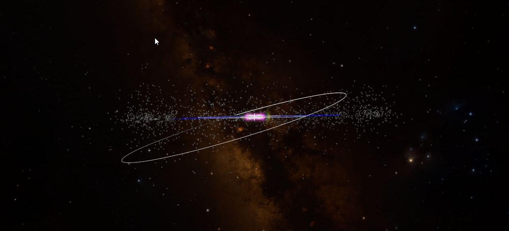
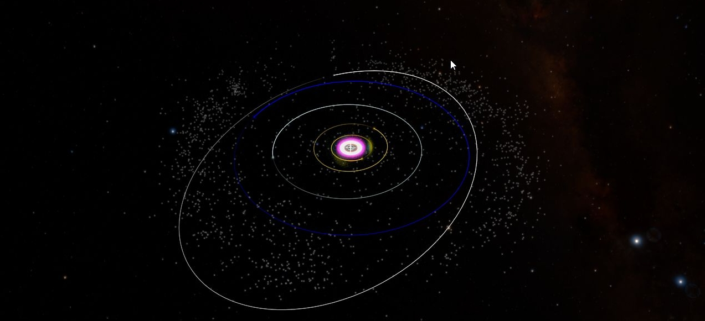

+++
title = "Authoring for Virtual Reality"
weight = 300
+++

When making tours for Virtual Reality (VR), it helps to come up with certain
rules about how the user interacts with the virtual environment and then stick
to them. This helps to make tours that don’t provide visual information that
is in conflict with other sensory input such as head orientation, which is
provided by your inner ear. This disparity between what you feel in the
physical environment (like turning your head) and what you see in the virtual
environment can create symptoms similar to motion sickness.

One of the amazing things about VR is that users have a natural sense of
interaction by moving their heads that requires no training. For instance the
[Impacts Tour](http://www.worldwidetelescope.org/Planetariums/Impacts) has
been shown to kids in Kindergarten, to seniors and all folks in between – all
of them interacted with the experience without any specific instruction – with
the exception that people do need to be reminded to look in some direction
other than forward.

In WWT there are two different types of VR experiences. One experience is a
more formal **Virtual Reality** experience. The other type we call **Divine
Visualization**.

# The Story

It is very important to start with the story. Tours naturally lend themselves
to fairly strict VR experiences and many WWT stories involve moving the user
through space and telling them what the objects are that they are seeing. This
is the basic structure of the Impacts tour. In the Impacts tour, we were in
this VR experience mode until the last two slides where we switched to Divine
Visualization where we showed the Solar System in an unrealistic way. Tilting
the view of the Solar System and even visualizing asteroids and orbit lines
break the illusion of what someone would actually see. In Impacts we
transition from one form to another, but don’t go back and forth in the Tour.

We created Impacts to test out the production features of WWT as well as learn
about VR production. You can follow your own production experiences but
certainly give adequate time for testing and refinement. Our experience is
that when you are in VR during production, you get your VR-legs and will be
able to handle more extreme motions and dissonance. That is why it is
important to have people who are not familiar with VR to test out your
experience. Carefully consider their input of how they interpret the
experience and any susceptibility they have to motion sickness.

# Creating Virtual Reality Experiences

Virtual Reality Experiences are constrained by rules; when these rules are
followed, they support the presence of the user in the virtual environment and
natural appreciation of scale and distance. Below are rules that we follow
when making VR tours.

1. Throughout a scene keep the same camera view. Don’t zoom your camera as you
   navigate a scene. That would be equivalent to scaling you to be bigger and
   smaller as you explore an environment. When you zoom the camera you change
   the stereo separation which confuses the sense of scale brain interprets
   through motion.
2. In the tour only control the XYZ translations. The user will naturally
   control rotation by moving their head, which is then coordinated with the
   physical input that the inner ear gives the brain.
3. Think about the user as a participant in the scene and actually decide
   _what is the representation of the user is in the virtual environment_ –
   the user’s avatar. Even if the avatar is not visually displayed it will
   have specific capability (e.g., size, stereo separation of eyes, speed
   etc.). For instance, if the user is an astronaut with a jet pack that
   responds to a thruster then the translations should be of that speed.
4. Be very careful about giving the user too much control. People thing they
   want to have as much control as possible, but if they don’t interact well
   with the environment, they can leave the system completely or be looking
   the wrong direction. Worse they can induce virtual reality sickness by
   quickly moving their view with the joystick in a way that is in conflict
   with their head’s motion. Training can help mitigate these effects but
   takes time and a carefully planned training experience.

In VR you can keep the zoom level constant and move the camera through a scene
by reference frame for the camera and move that.

# Creating Divine Visualization Experiences

Divine Visualization is a category of experiences where the producer breaks
the rules of VR in order to tell a story or explore data. In this view, the
user is not limited by rules of interaction of an avatar with a virtual
environment, as is the case for creating strict VR experiences above. One
simple example is moving the view of the Solar System from edge-on to face on.
Here the divine viewpoint, which is not constrained by the laws of physics, is
understood by the user as viewing and potentially manipulating the Solar
System as a model or scientific visualization. As a producer, you may feel
this is necessary to communicate some things this way. The user will probably
not feel as though they are moving wildly in the Solar System but will likely
interpret this as playing with a 3D model in a classroom.

When you decide to break the rules, you can do anything you want. However, you
should be aware of dissonance between visual and inner-ear-provided
orientations and try to minimize them.

1. Keep objects in front of the user while you are moving or changing them
   (e.g. rapid, non-linear advances in time). This will reinforce the feeling
   that the user is manipulating an object.
2. Don’t introduce motions that would require the user to turn their head very
   much. This will reduce the amount of dissonance.
3. Be very careful in creating interactive VR experiences where the user can
   use an Xbox controller to fly around a scene. Even experienced VR producers
   can get sick doing this. If you are designing an unconstrained interactive,
   we recommend some training phase of the interactive where they are taught
   how to move their view slowly, especially in rotation.
