+++
title = "Web-based Tour Authoring"
weight = 100
+++

While you are exploring the universe you can create tours that capture your
exploration and share them easily with your friends. This can all be done
easily in the new and improved web client. The new web client is built upon
WebGL which enables desktop-like performance and graphics functionality from
within a web browser. Web-based tours use Slides, which are similar to those
in PowerPoint. Tours authored in the Web Client can be played back on any
device that support WebGL, including smart phones, tablets and PCs with any
operating system. The tours can also be loaded into the Windows Desktop client
used in planetariums or other complex visualization facilities.

# Creating Your First Web-Based Tour

1. Start by opening the
   [WWT web client](//www.worldwidetelescope.org/webclient/). Although you can
   play the tour you create on the web on small mobile devices, you probably
   want a desktop or laptop with a mouse (with left, right buttons and scroll
   wheel) or modern track pad (with similar gestures).
2. Throughout this tutorial, we will have you change initial views which
   require you to navigate the view.
   1. The left-mouse click and drag – moves the camera’s view of the sky.
   2. Control-left-mouse click and drag – rotates the view around the center
      point.
   3. **When editing at tour**, the right-mouse click on an object brings up a
      context menu where you can select items like “Properties”. **When not
      editing**, the right click brings up a finder scope where you can find
      more information about an object.
   4. Scroll wheel zooms in-and-out.
3. Now, let’s actually build the tour. Under the “Guided Tours” tab at the
   top, select “Create New Tour”. This will create a tab entitled “New Tour”
   to the right of “Setting” tab.
   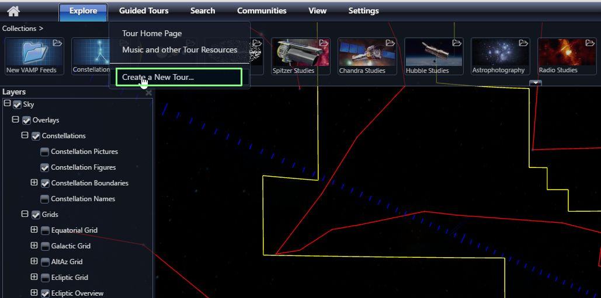
4. Let’s now bring up a Tour Properties box. You must provide a Tour Title,
   but all other fields are optional. The Tour Title also changes the title of
   the tour in the menu bar at the top. Here you can see the tile in both
   palaces is “My First Tour”.
   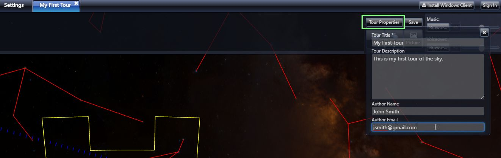
5. Let’s setup the initial view for the Tour. For this tour we will be
   creating a tour of the Sky. It is the default but make sure that Sky is
   selected in the **Look At** menu in the lower left. Move the screen around
   until you have a view of the sky you like and then click “Add New Slide”
   button in the slide bar at the top.
   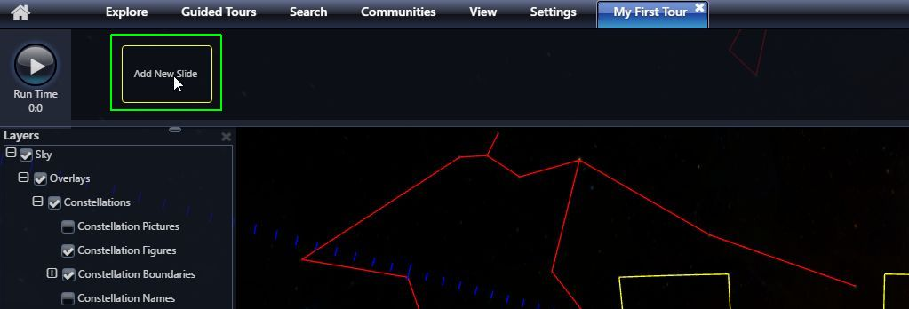
6. This will create your fist slide and capture a thumbnail image for it from
   the current view. It will also setup a default duration for the slide,
   which is 10 seconds. You can adjust this by clicking in the time field and
   directly typing the time or using the little up and down arrows on either
   side of the time.
   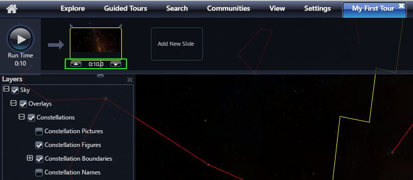
7. It is useful to show slide numbers to keep track of where you are. Do to
   that under “Guided Tours” tab select “Show Slide Numbers. This will put a
   numeric slide number at the top of each slide.
   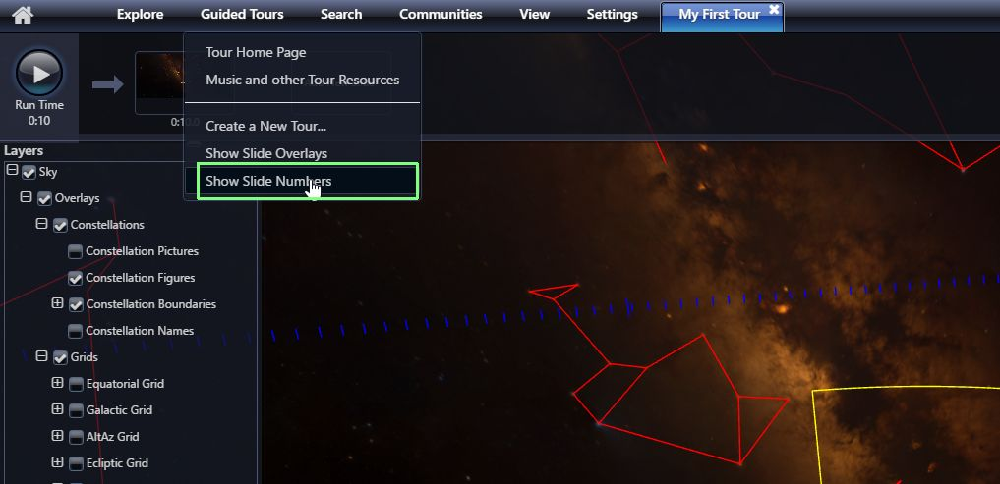
8. You now have a slide with an initial view. You now should set an ending
   viewpoint for the slide. When you play the tour the viewpoint will smoothly
   change between the beginning and ending camera positions. To set the end
   slide position, change the view, using the mouse controls explained in item
   2 above. Then right-click on the slide and select “Set End Camera
   Position.” Note, there is a yellow ear on the top left of the slide when
   you are looking at the start position and on the right hand part of the
   slide when looking at the end camera position.
   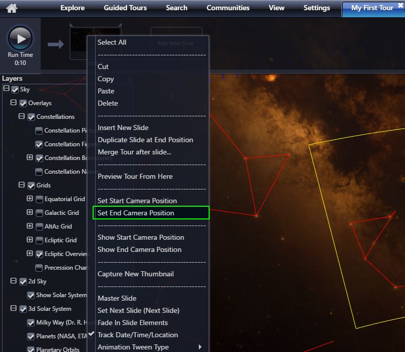
9. Now you have a 10-second tour consisting of one slide. Go ahead and press
   the Play button to see how it works.
10. When the tour is finished playing, click “Add New Slide” again. This will
    add a second slide using the end camera position as the starting position
    for the new slide. If a sequence of slides is intended to show contiguous
    motion, you should make sure that the end camera position of one slide is
    the same as the beginning camera position of the next one.
11. You can continue these steps to create a sequence of slides.
12. Between every two slides there are various transition options, shown
    below. Note that some transitions take time which is taken out of the
    start time for the second slide (Slide B). Note that the transitions can
    be thought of as being added on top of camera motion defined by the
    slides.
    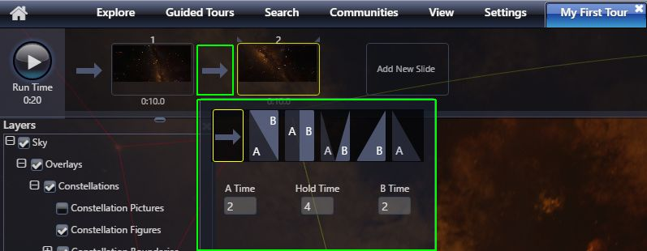
    1. The default arrow means that the slide moves from the end of one slide
       to the next without pause. This is used for contiguous motion.
    2. The `A\B` transition is a cross-fade between two viewpoints.
    3. The `A|B` transition is a hard cut between two viewpoints.
    4. The `A\/B` transition is one that fades through black between two
       viewpoints.
    5. The `/B` transition is a hard cut from A to black and then fades in B
    6. The `A\` transition fades out to black and then does a hard cut to B.
13. At the upper right-hand side is an interface that allows you to add
    overlay elements to slides: Text, Shapes and Pictures.
    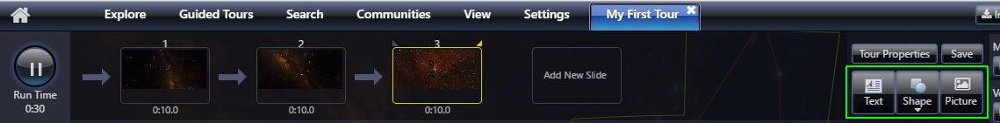
    1. Clicking “Text” shows a text dialog box where you can enter text,
       select font and font-size, foreground color, background color, style
       (bold, italics, underline), text and background colors.
    2. You can add built-in shapes, such as circle, rectangle etc.
    3. Finally, you can add pictures. Clicking this opens a dialog box where
       you can browse for local images to add.
    4. By default, all objects that are added stay in the same place on the
       screen throughout the slide. However, once added, you can right-click
       on an object and click “Animate.” This enables you to specify how the
       object should look at the beginning and also the end of the slide. Once
       an object is animated, you can right click on the slide and “Show Start
       Camera Position” and then change the location, size etc. of the object
       and the right-click and “Set Start Camera Position.” You can do this
       again for the end positions changing the end characteristics of
       animated objects. You can also turn off animation. It will default to
       whatever slide position is showing (Start or End). For instance, the
       example below shows the galaxy cluster Abell 521. A ring and text label
       have been added to identify the object, which is at the upper left at
       the Slide Start position. The camera was moved such that the object was
       in the lower right at the Slide End. The text and ring overlay objects
       were animated (right-click, select “Animate”). They were positioned
       over the object at the slide start and moved to where the object was at
       the slide end. Below are screenshots of the slide start and end. When
       you play the slide the object and text move smoothly from start to end.
       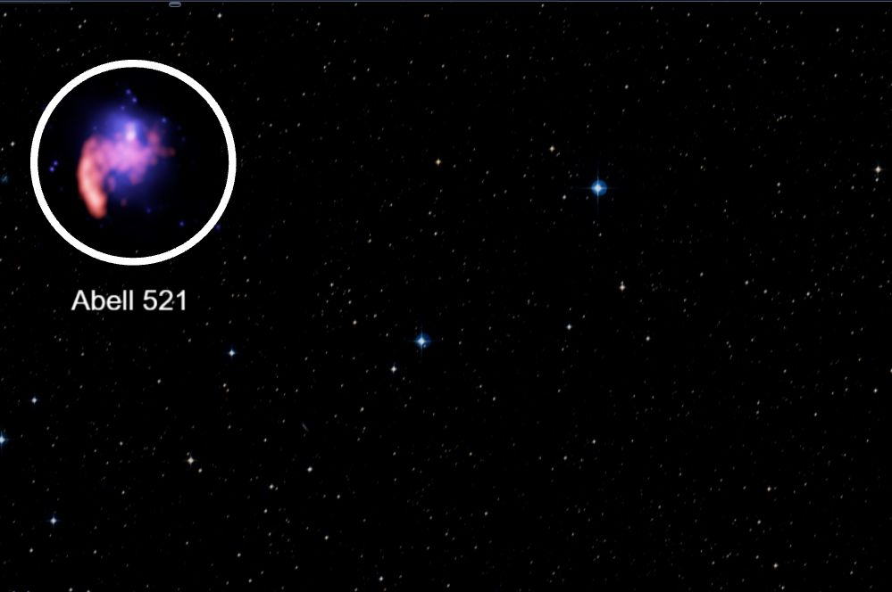
       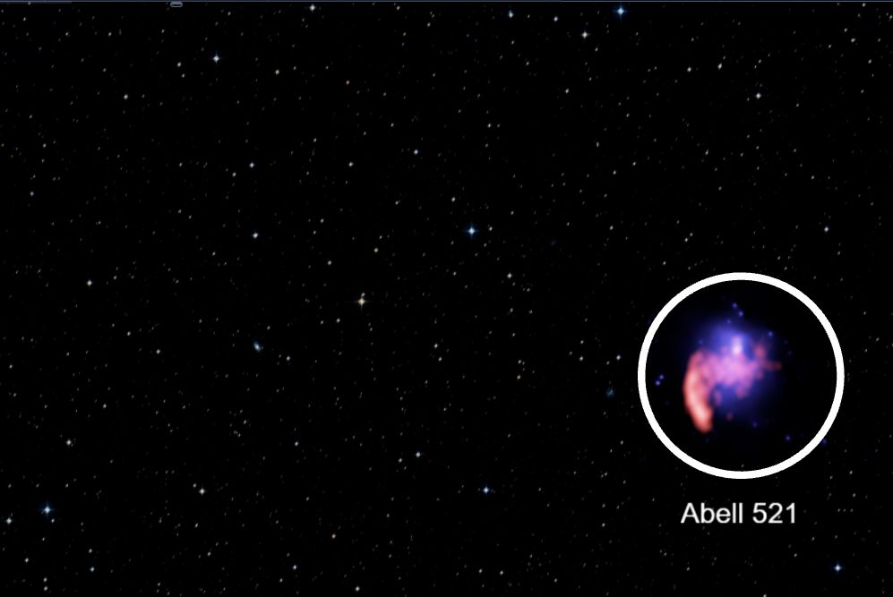
14. If you have a long tour it is time-consuming to watch the entire tour to
    see the effect of a change near the end. You can right-click in any slide
    and select “Preview Tour From Here” and the tour will play from that
    location.
15. You can add an audio soundtrack (Music and/or Voiceover). The files must
    be MP3. The volume of each audio file is controlled by a slider and are
    mixed together during playback. Each slide can have its own audio tracks.
    This is helpful when you change the timing of a slide you don’t have to
    re-record the entire narration. Audio will end at the end of the slide
    unless slide is a master slide (see below)
    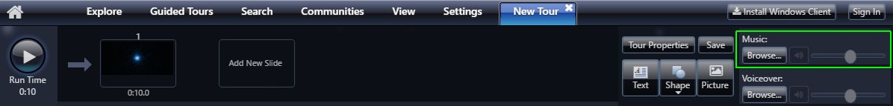
16. There is special type of slide called a Master Slide. You make a slide a
    Master slide by right-clicking and selecting “Master Slide.” Overlay
    elements (Text, Shapes and Pictures) remain on all subsequent slides until
    another Maser Slide is encountered. This also affects audio. Audio on a
    master slide continues to play through subsequent slides. Per-slide audio
    can be added on slides after the master slide and both audio tracks will
    be mixed. Objects on a master slide (Text, Shape, Picture and Audio)
    remain until the tour ends or encounters another Master Slide.
    
17. You can reorder the slides by clicking a slide and moving it to a new
    location in the slide set. You can select multiple slides by holding down
    Control while clicking on slides; selected slides will be outlines in
    yellow.
18. When you are want to save the tour, you can click the Save button in the
    upper right. Currently, saving the file saves a local .wtt file in your
    Downloads folder.
    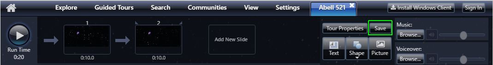

# How is Web-based Authoring Different from Authoring with the Windows Desktop Client?

For those familiar with the Windows Desktop Client, it is instructive to show
how the Web Client differs from the Desktop one.

1.  No Timeline-based tours that have Keyframes.
2.  Audio Files must be MP3.
3.  The Web Client cannot be used in a dome or cluster installation.
4.  The Web Client cannot render to video.
5.  No VR capability.
